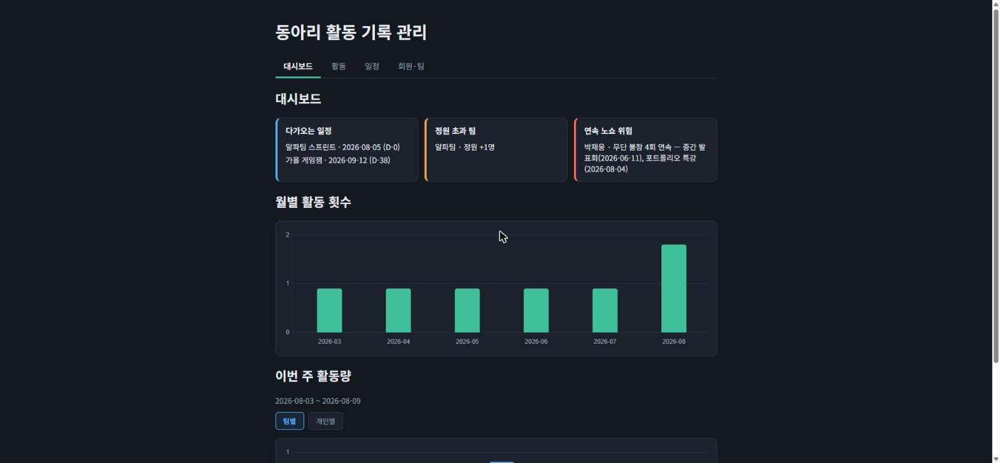
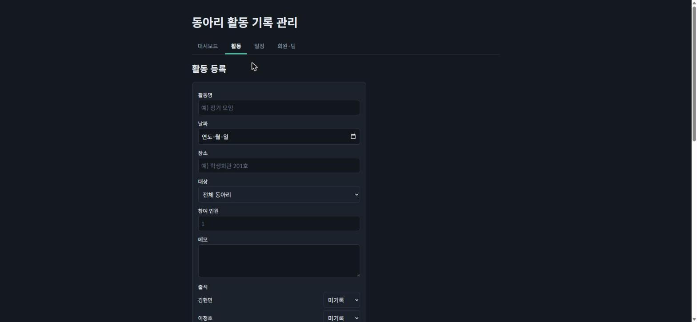
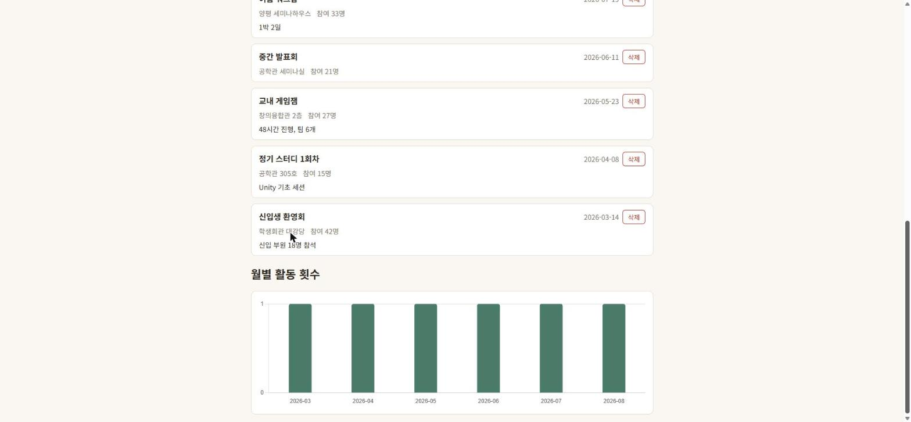
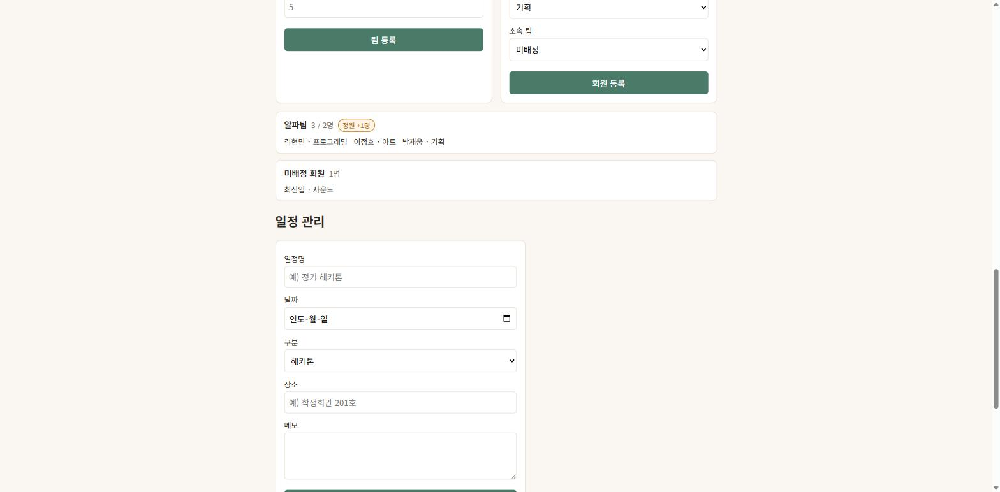
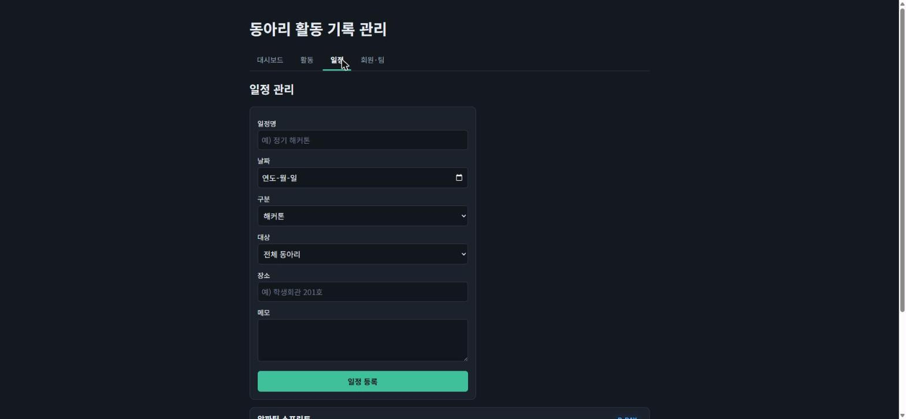

# Club Activity Tracker (동아리 활동 기록 관리 웹앱)

2026-08-05 해커톤 프로젝트 · 1팀 클로드 아카이브

동아리 임원이 활동 내역을 등록하고 조회·삭제할 수 있는 웹앱이다.
서버나 데이터베이스 없이 브라우저 localStorage에만 데이터를 저장한다.

## 팀원 명단과 역할

| 이름 | GitHub | 역할 |
|---|---|---|
| 박재웅 | [@lala11112](https://github.com/lala11112) | 기획 (기능 기획서 `ideas/재웅.md` 작성), 보고서 작성 |
| 김현민 | [@Kodol05](https://github.com/Kodol05) | GitHub 저장소 관리, CLAUDE.md 작성, 공통 저장 함수, 활동 등록·입력 검증, 기간 필터, 월별 통계 차트, 회원·팀 관리, 반응형 |
| 이정호 | [@LeeJungHo0201](https://github.com/LeeJungHo0201) | 활동 목록 조회, 활동 삭제, 일정 관리 |

기능 단위로 분담하고, 기능 하나가 동작하면 바로 커밋했다.

## 구현 기능

### 필수 기능
- [x] **활동 등록** — 활동명·날짜·장소·참여 인원·메모를 입력해 저장
- [x] **활동 목록 조회** — 최신순 정렬, 빈 목록일 때 안내 문구 표시
- [x] **활동 삭제** — 개별 삭제, 삭제 전 확인 절차

### 입력값 검증
- [x] 활동명 필수 (공백만 입력 시 저장 불가)
- [x] 미래 날짜 입력 불가
- [x] 참여 인원은 1 이상의 정수

### 선택 기능
- [x] **기간 필터** — 시작일~종료일로 활동 필터링(양 끝 포함), 초기화 버튼, 결과 없을 때 별도 안내
- [x] **월별 활동 횟수 통계 차트** — Chart.js 막대차트, 기간 필터와 연동
- [x] **반응형 레이아웃** — 모바일 화면(600px 이하) 대응
- [x] **회원·팀 관리** — 팀/회원 등록, 팀 배정, 이름 중복 차단(대소문자 무시), 정원 초과 시 `정원 +N명` 경고 배지(초과 배정은 차단하지 않음), 미배정 회원 별도 표시
- [x] **일정 관리** — 예정 일정 등록(해커톤/축제/정기활동/기타), D-day 가까운 순 정렬
- [x] **출석 기록** — 활동 등록 시 회원별 출석 상태(미기록/참석/사전 불참/무단 불참) 기록, 참석자 수로 참여 인원 자동 계산
- [x] **연속 노쇼 위험 판정** — 무단 불참 2회 연속인 회원을 근거 활동 2건과 함께 표시 (참석·사전 불참이 끼면 연속 초기화, 미기록은 판정에서 제외)
- [x] **대시보드** — 다가오는 일정, 정원 초과 팀, 연속 노쇼 위험을 한 화면에 통합
- [x] **일정 → 활동 전환** — 지난 일정을 활동 등록 폼으로 복사(대상 팀·출석 대상 포함), 저장 후 중복 변환 차단, `기록 완료`/`연결된 활동이 삭제됨` 상태 표시
- [x] **활동 대상 지정** — 전체 동아리 / 특정 팀 선택, 팀 전용 활동은 해당 팀 회원만 출석 대상으로 표시
- [x] **활동 기록 히트맵** — GitHub 기여도 그래프(잔디) 형식으로 최근 1년 활동을 날짜별 정사각형으로 표시, 활동 수에 따라 4단계 농도
- [x] **주간 활동량 통계** — 이번 주(월~일) 팀별·개인별 활동량 차트, 보기 전환 토글

## 실행 방법

별도 설치나 빌드가 필요 없다.

```
git clone https://github.com/Kodol05/hackathon-1-claude-archive.git
```

`index.html` 파일을 브라우저로 열면 바로 실행된다.

> 로컬 서버로 열고 싶다면 저장소 폴더에서 `python -m http.server 8000` 실행 후
> 브라우저에서 `http://localhost:8000` 에 접속한다.

## 화면 구성

상단 탭으로 네 화면을 전환한다. 어두운 게임 스튜디오 운영 콘솔 스타일을 사용하며,
상태는 색만으로 구분하지 않고 배지 문구를 함께 표시한다. (정상 청록 / 일정 파랑 / 정원 초과 주황 / 노쇼 위험 빨강)

| 화면 | 내용 |
|---|---|
| 대시보드 | 다가오는 일정, 정원 초과 팀, 연속 노쇼 위험 + 월별·주간 통계 차트 |
| 활동 | 활동 등록(출석 포함), 기간 필터, 활동 목록·삭제 |
| 일정 | 일정 등록, D-day 정렬 목록, 활동으로 기록 |
| 회원·팀 | 팀·회원 등록, 팀 카드와 정원 초과 경고, 미배정 회원 |

## 실행 화면

### 대시보드


임원이 확인해야 할 운영 상태를 한 줄로 모아 보여준다. 다가오는 일정은 D-day로, 권장 정원을 넘긴 팀은 초과 인원으로, 무단 불참이 2회 이상 연속된 회원은 판정 근거가 된 활동과 함께 표시된다.

### 활동 등록 화면


활동명·날짜·장소·참여 인원·메모를 입력해 등록한다. 검증에 걸리면 폼 아래에 빨간 오류 문구가 표시된다.

### 활동 목록과 월별 통계


저장된 활동이 최신순으로 표시되고, 각 항목에서 바로 삭제할 수 있다.
아래 막대차트는 월별 활동 횟수를 보여주며 기간 필터를 적용하면 함께 갱신된다.

### 회원·팀 관리


팀과 회원을 등록하고 팀에 배정한다. 인원이 권장 정원을 넘으면 `정원 +N명` 경고 배지가 뜨지만 배정 자체는 막지 않는다. 팀이 없는 회원은 "미배정 회원" 카드에 따로 모인다.

### 일정 관리


앞으로 예정된 일정을 등록하면 D-day가 가까운 순서로 정렬되어 표시된다.

## 기술 스택

- HTML / CSS / JavaScript (프레임워크 없음)
- 데이터 저장: 브라우저 localStorage (키: `activities`)
- Chart.js 4.5.0 (CDN)

## 파일 구조

```
index.html                 화면 구조
style.css                  스타일
app.js                     기능 로직
CLAUDE.md                  Claude Code 작업 규칙
ideas/재웅.md              기능 기획서
tools/extract_prompts.py   보고서용 프롬프트 추출 스크립트
docs/                      실행 화면 스크린샷
```
